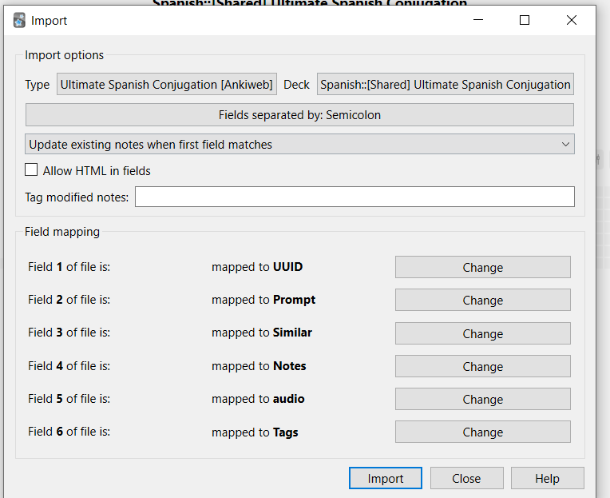

## Ultimate Spanish Conjugation

## This fork adds audio for each card

Added new field added to generate MP3 audio by AwesomeTTS addin within Anki application

<b>How to:</b>
* Add field in card default card template

* Import new file and select fields

* In "Browse" select all deck cards and click AwesomeTTS
* Select <b>SpanishDict</b> and <b>Spanish</b> voice
* Select new field as <b>source</b> and <b>destination fields</b>, click <b>Overwrite destination field w/ Media Filename</b>

* Wait until MP3 are generated
<i>Note: to decrese stop between generating, go to Awesome options and decreasing Throttling option</i>
* 

## TL;DR: this is an AWESOME deck, but ONLY if you [READ THE MANUAL](http://www.asiteaboutnothing.net/w_ultimate_spanish_conjugation.html)

- [The Manual](http://www.asiteaboutnothing.net/w_ultimate_spanish_conjugation.html) (**_read it!!!_**)
- The [Deck on AnkiWeb](https://ankiweb.net/shared/info/638411848)
- Deck [text source](https://github.com/boolbag/Anki-Goodies/blob/master/Decks/Spanish/source/Ultimate%20Spanish%20Conjugation%20%7B%7BCloze%7D%7D.4anki) and [CSS](https://github.com/boolbag/Anki-Goodies/blob/master/Decks/Spanish/source/styling.css)
- [Discuss on Reddit](https://www.reddit.com/r/Anki/)

### Editing the Text File? Use a comfortable environment

See the [top of the repo](https://github.com/boolbag/Anki-Goodies) for how to edit flash cards with a cool color-coded environment like below.

